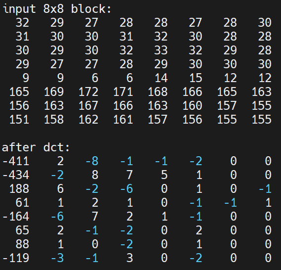
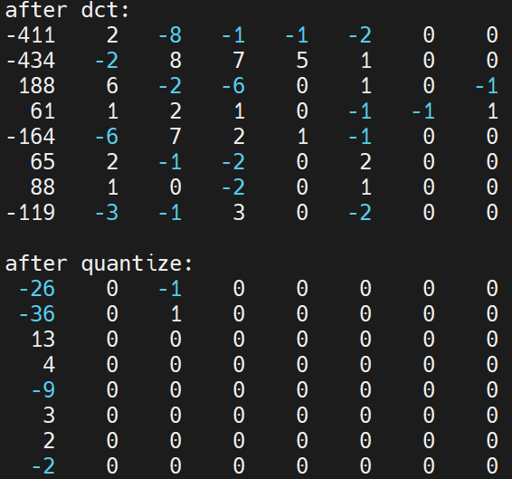
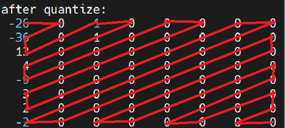
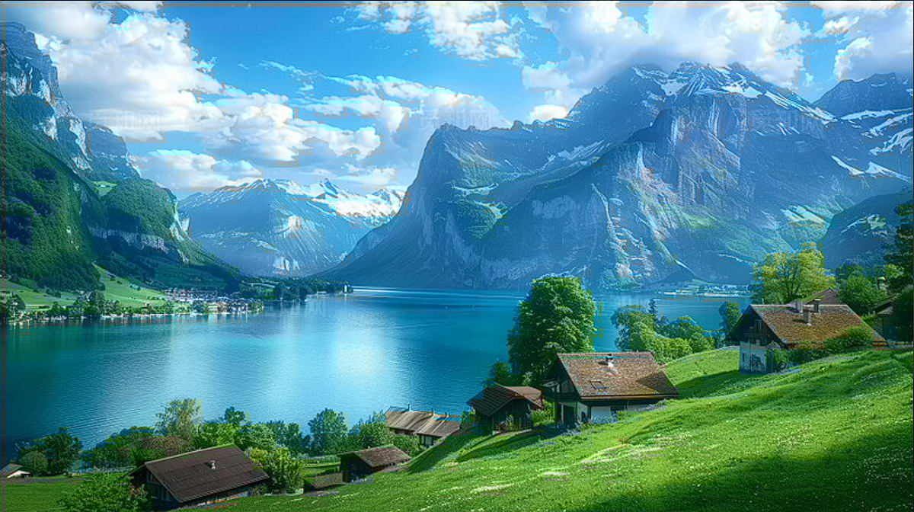

@[TOC](jpeg编码原理到实现)

---

## 揭秘 JPEG：一步步用C语言实现自己的jpeg编码器

嘿，各位编程和图像爱好者！你每天都在网上看到无数的 JPEG 图片，有没有好奇过它们是怎么变得那么小的，同时看起来还不错的？JPEG 是一种非常流行的图像压缩格式，广泛应用于网络和数码相机中。

今天，我们将不再仅仅是 JPEG 的使用者，而是要变成它的“创造者”！我们将一起探索 JPEG 编码的基本原理，并且通过分析一个用 C 语言编写的简单 JPEG 编码器 (`jpeg_encoder.c`)，让你亲手体验这个过程。准备好了吗？让我们开始这段奇妙的旅程吧！

## JPEG 编码核心步骤：压缩的魔法

JPEG 压缩并不是一步到位的，它像一条精密的流水线，包含了好几个关键步骤。我们的目标是尽可能地减小文件大小，同时尽量保持图像的视觉质量。下面就是这条流水线的主要工序：

### 1. 色彩空间转换 (RGB -> YCbCr)：关注人眼敏感点

我们通常接触的图片是 RGB 格式的（红、绿、蓝）。但人眼对**亮度**（图像的明暗程度）比对**色度**（图像的颜色信息）更敏感。JPEG 利用了这一点。

*   **为什么转换？** 为了把亮度和颜色分开处理，这样我们就可以对不太敏感的颜色信息进行更大程度的压缩。
*   **YCbCr 是什么？**
    *   `Y`: 亮度 (Luminance) - 代表明暗。
    *   `Cb`: 蓝色色度 (Chrominance Blue) - 代表蓝色分量与亮度之间的差异。
    *   `Cr`: 红色色度 (Chrominance Red) - 代表红色分量与亮度之间的差异。

**代码实现 (`rgb_to_ycbcr_and_subsample` 函数):**

我们的 C 代码中，`rgb_to_ycbcr_and_subsample` 函数负责这个转换。它遍历每个像素，应用标准的转换公式：

```c
// 遍历每个像素进行转换
for (uint16_t y = 0; y < encoder->height; ++y) {
    for (uint16_t x = 0; x < encoder->width; ++x) {
        // ... 获取 R, G, B 值 ...

        // 使用 JPEG 标准的 RGB 到 YCbCr 转换公式
        double Y_f =    0.299   * R + 0.587   * G + 0.114   * B;
        double Cb_f = - 0.168736* R - 0.331264* G + 0.5     * B + 128.0; // Cb/Cr 需要 +128 偏移
        double Cr_f =   0.5     * R - 0.418688* G - 0.081312* B + 128.0;

        // 存储 Y 分量 (钳位到 0-255)
        encoder->y_data[y_idx] = clamp_byte((int)round(Y_f));

        // ... (色度抽样代码，见下一步) ...
    }
}
// YCbCr 数据已生成，释放原始 RGB 数据内存
free(encoder->rgb_data);
encoder->rgb_data = NULL;
```

这段代码读取每个像素的 RGB 值，通过数学公式计算出对应的 Y, Cb, Cr 值，并将 Y 值存储起来。注意 Cb 和 Cr 计算后加了 128，这是为了将范围从可能为负数调整到 0-255 之间。转换完成后，原始的 RGB 数据就被释放了。

### 2. 色度抽样 (Chroma Subsampling)：丢弃部分颜色信息

既然人眼对色度不那么敏感，我们是不是可以少存一些色度信息呢？没错！这就是色度抽样。

*   **原理：** 对于一小块区域（比如 2x2 像素），我们可以只保留一个平均的色度值（Cb 和 Cr），但保留所有像素的亮度值（Y）。
*   **常见模式 (4:2:0):** 这是最常见的模式。它意味着对于每 4 个 Y 值（在一个 2x2 的块里），我们只存储 1 个 Cb 值和 1 个 Cr 值。这样，色度信息的数据量就减少了 75%！

**代码实现 (`rgb_to_ycbcr_and_subsample` 函数):**

在同一个函数里，紧接着 Y 值的计算，代码对 Cb 和 Cr 进行了二次采样：

```c
// 对 Cb 和 Cr 进行二次采样 (只在 2x2 块的左上角像素处计算并存储)
if ((y % 2 == 0) && (x % 2 == 0)) {
    size_t cbcr_idx = (y / 2) * encoder->cbcr_width + (x / 2); // 计算在 Cb/Cr 平面中的索引

    // 对 2x2 区域的 Cb/Cr 值进行简单平均
    // ... (计算 2x2 区域内所有像素 Cb/Cr 的平均值 cb_avg, cr_avg) ...
    double cb_sum = 0, cr_sum = 0;
    int count = 0;
    // ... (循环遍历 2x2 区域，累加 Cb, Cr 并计数 count) ...

    // 存储平均后的 Cb/Cr 值 (钳位到 0-255)
    encoder->cb_data[cbcr_idx] = clamp_byte((int)round(cb_sum / count));
    encoder->cr_data[cbcr_idx] = clamp_byte((int)round(cr_sum / count));
}
```

这段代码只在偶数行和偶数列（`y % 2 == 0 && x % 2 == 0`）的位置执行。它会计算当前 2x2 邻域内所有像素的 Cb 和 Cr 值的平均值，然后将这个平均值存储到尺寸缩小了的 `cb_data` 和 `cr_data` 数组中。这就实现了 4:2:0 采样。

### 3. 分块 (Blocking)：化整为零

JPEG 不是一次处理整个图像，而是将其分割成很多个 8x8 像素的小块。

*   **为什么分块？** 后续的 DCT 变换是在这些 8x8 的小块上进行的。这使得计算更可控，也更适合局部图像特征的处理。

**代码实现 (`encode_image` 函数):**

虽然没有一个叫做 `blocking` 的函数，但分块的操作体现在主编码循环 `encode_image` 中提取数据块的方式。代码会遍历所谓的 MCU（最小编码单元，在 4:2:0 模式下通常包含 4 个 Y 块，1 个 Cb 块，1 个 Cr 块），并在处理每个分量时提取 8x8 的像素块：

```c
// 在 encode_image 函数内部的 MCU 循环中...
// --- 处理 Y 分量的 4 个 8x8 块 ---
for (int v_samp = 0; v_samp < y_comp->v_samp_factor; ++v_samp) {
    for (int h_samp = 0; h_samp < y_comp->h_samp_factor; ++h_samp) {
        // 1. 从 Y 数据平面提取当前 8x8 块
        // ... (计算块的起始坐标 block_y_start, block_x_start) ...
        for(int y=0; y<BLOCK_SIZE; ++y) {
            for(int x=0; x<BLOCK_SIZE; ++x) {
                 // ... (计算源像素坐标 src_y, src_x，处理边界) ...
                 input_block[y*BLOCK_SIZE + x] = encoder->y_data[src_y * encoder->width + src_x];
                 // ... (边界处理) ...
            }
        }
        // 接下来对 input_block 进行 DCT, Quantization, Huffman ...
    }
}
// --- 类似地处理 Cb 和 Cr 的 1 个 8x8 块 ---
// ...
```

这里的 `input_block` 就是我们提取出来的 8x8 像素块（来自 Y, Cb 或 Cr 数据），后续的处理都将基于这个小块进行。`BLOCK_SIZE` 常量被定义为 8。

### 4. 离散余弦变换 (DCT)：从像素到频率

这是 JPEG 压缩中的核心数学变换。

*   **DCT 的作用：** 它将 8x8 的像素块从**空间域**（表示像素的位置和值）转换到**频率域**。转换后，得到的是 64 个 DCT 系数。
    *   左上角的系数（DC 系数）代表了这个块的**平均**亮度/色度（低频信息）。
    *   越往右下角的系数，代表图像中变化越**快**的细节（高频信息，如边缘、纹理）。
*   **关键特性：** 对于自然图像，大部分能量（重要的视觉信息）会集中在左上角的少数低频系数上，而右下角的高频系数通常数值很小或接近于零。这为后续的压缩打下了基础。
* 一维DCT变换公式如下(二维DCT其实就是执行两次一维DCT变换，先对每一行执行一维DCT，再将行DCT变换后的系数按列进行DCT变化)：

$$ X_k = \sum_{n=0}^{N-1} x_n \cdot \cos\left(\frac{\pi}{N} \left(n + \frac{1}{2}\right) k\right), \quad k = 0, 1, 2, \ldots, N-1 $$

**代码实现 (`perform_fdct` 函数):**

`perform_fdct` 函数实现了正向 DCT。它首先对输入的 8x8 块进行 "Level Shift"（将 0-255 的值减去 128，中心化到 0 附近），然后执行 DCT 计算：

```c
// --- 正向 DCT (FDCT) ---
// 对输入的 8x8 像素块执行 FDCT，输出 8x8 的 DCT 系数
void perform_fdct(const uint8_t *input_block, int16_t *output_coeffs) {
    double block[BLOCK_SIZE][BLOCK_SIZE]; // 用于存储 level-shifted 像素值
    double temp[BLOCK_SIZE][BLOCK_SIZE];  // 中间计算结果

    // 1. Level Shift: 将 0-255 的像素值减去 128，转换到 -128 到 127 的范围
    for (int y = 0; y < BLOCK_SIZE; y++) {
        for (int x = 0; x < BLOCK_SIZE; x++) {
            block[y][x] = (double)input_block[y * BLOCK_SIZE + x] - 128.0;
        }
    }

    // 2. 执行两次一维 FDCT (先对行，再对列)
    // 2a. 对每一行执行一维 FDCT
    for (int y = 0; y < BLOCK_SIZE; y++) {
        for (int u = 0; u < BLOCK_SIZE; u++) { // u 是频率索引
            double sum = 0.0;
            for (int x = 0; x < BLOCK_SIZE; x++) { // x 是空间索引
                sum += block[y][x] * G_FDCT_COS[x][u]; // 使用预计算的余弦值
            }
            double c_u = (u == 0) ? 1.0 / sqrt(2.0) : 1.0; // DCT-II 的归一化因子 C(u)
            temp[y][u] = c_u * sum / sqrt(BLOCK_SIZE / 2.0); // 标准 DCT-II 的归一化分母 sqrt(N/2)
        }
    }

    // 2b. 对临时结果的每一列执行一维 FDCT
    for (int u = 0; u < BLOCK_SIZE; u++) { // u 现在是列索引 (频率)
        for (int v = 0; v < BLOCK_SIZE; v++) { // v 是行索引 (频率)
            double sum = 0.0;
            for (int y = 0; y < BLOCK_SIZE; y++) { // y 是行索引 (空间)
                sum += temp[y][u] * G_FDCT_COS[y][v]; // 使用预计算的余弦值
            }
            double c_v = (v == 0) ? 1.0 / sqrt(2.0) : 1.0; // DCT-II 的归一化因子 C(v)
            // 将最终的 DCT 系数四舍五入并存储为 16 位整数
            output_coeffs[v * BLOCK_SIZE + u] = (int16_t)round(c_v * sum / sqrt(BLOCK_SIZE / 2.0));
        }
    }
}

// 在 main 函数中初始化余弦值:
init_fdct_cos(); // 预计算 FDCT 余弦值

// 预计算 FDCT 余弦值 (与 IDCT 相同)
void init_fdct_cos() {
    for (int i = 0; i < BLOCK_SIZE; i++) {
        for (int j = 0; j < BLOCK_SIZE; j++) {
            G_FDCT_COS[i][j] = cos((2.0 * i + 1.0) * j * M_PI / (2.0 * BLOCK_SIZE));
        }
    }
}
```
代码通过两次一维 DCT（先对行，再对列）来实现二维 DCT。它使用了预先计算好的余弦值 (`G_FDCT_COS`) 来加速计算。输出的 `output_coeffs` 数组就包含了 64 个 DCT 系数。**需要注意的是**：代码中与计算的FDCT余弦值是按列存储的。
我们来观察一下，DCT后的数据与原数据对比：

可以看到，DCT变换后，大部分的重要图像信息集中在了左上角，这时还没有压缩，因为原信号还可以根据DCT后的数据完全还原，下一步的量化才是压缩效率的关键。
### 5. 量化 (Quantization)：主要的有损压缩步骤

这是 JPEG **有损压缩**的关键所在，也是决定最终图像质量和文件大小的核心环节。

*   **原理：** 我们用一个“量化表”（Quantization Table）去除 DCT 系数中的精度。这个表也是 8x8 的，表中的值越大，对应位置的 DCT 系数被“压”得越狠（精度损失越多）。通常，高频系数（对应表右下角）会被赋予更大的量化值，因为人眼对高频细节损失不敏感。
*   **怎么做？** 将 DCT 系数矩阵中的每个值，分别除以量化表中对应位置的值，然后四舍五入取整。
*   **结果：** 很多高频系数经过量化后会变成 0，低频系数的精度也降低了。这就是信息损失的地方，但也是压缩效率的来源。

**代码实现 (`quantize` 函数 和 `scale_quant_table` 函数):**

`quantize` 函数执行这个除法和取整操作：

```c
// 对 8x8 的 DCT 系数块进行量化
void quantize(int16_t *coeffs, const uint16_t *quant_table) {
    for (int i = 0; i < BLOCK_SIZE * BLOCK_SIZE; ++i) {
        // 量化：用 DCT 系数除以量化表对应位置的值，并进行四舍五入取整
        double div = (double)coeffs[i] / quant_table[i];
        coeffs[i] = (int16_t)floor(div + 0.5); // 简单的四舍五入方法
    }
}
```

这里的 `quant_table` 是怎么来的呢？它是由标准量化表（代码中定义的 `STD_LUM_QUANT_TBL` 和 `STD_CHROM_QUANT_TBL`）根据用户指定的“质量因子”（Quality Factor）缩放得到的。`scale_quant_table` 函数负责这个缩放：

```c
// 根据质量因子缩放标准量化表
void scale_quant_table(const uint8_t *std_table, uint16_t *output_table, int quality_factor) {
    // ... (根据 quality_factor 计算 scale_factor) ...
    for (int i = 0; i < 64; ++i) {
        int temp = ((int)std_table[i] * scale_factor + 50) / 100; // 缩放并四舍五入
        // ... (确保量化值在 1 到 255 之间) ...
        output_table[i] = (uint16_t)temp;
    }
}

// 在 main 函数中调用:
scale_quant_table(STD_LUM_QUANT_TBL, encoder.quant_tables[0], encoder.quality_factor); // 缩放亮度量化表
scale_quant_table(STD_CHROM_QUANT_TBL, encoder.quant_tables[1], encoder.quality_factor); // 缩放色度量化表
```

质量因子越高，`scale_factor` 越小，量化表的值越接近标准值（或更小），保留的精度越多，图像质量越好，但文件也越大。反之亦然。

我们来观察一下，DCT和量化后的8X8数据对比：


可以看到，在量化后，大部分数据都变成了0，这就是压缩率的来源。
### 6. Zigzag 扫描：为熵编码做准备

量化之后，8x8 的系数矩阵中通常含有很多 0，尤其是在右下角（高频区域）。为了更有效地压缩这些 0，我们不按常规的行或列顺序读取系数，而是采用 Z 字形（Zigzag）扫描。

*   **为什么 Zigzag？** 它将 8x8 矩阵重新排列成一个 64 个元素的一维序列。由于能量集中在左上角（低频），Zigzag 扫描倾向于将非零系数排在前面，后面跟着一长串的 0。

Zigzag扫描顺寻如下:


**代码实现 (使用 `G_ZIGZAG` 数组):**

代码中使用了一个预定义的 `G_ZIGZAG` 数组来指定扫描顺序。在 `encode_image` 函数对 AC 系数进行编码时，它就按这个顺序读取量化后的系数：

```c
// 在 encode_image 函数的 AC 系数编码循环中...
for (int k = 1; k < 64; ++k) { // 从第 1 个 AC 系数开始 (按 Z 字形顺序)
    int coeff = quant_coeffs[G_ZIGZAG[k]]; // 获取 Z 字形扫描的下一个系数
    if (coeff == 0) {
        zero_run++; // 如果是 0，增加连续 0 的计数
    } else {
        // ... (处理非零系数和前面的 zero_run) ...
    }
}
```

`G_ZIGZAG[k]` 给出了第 k 个要访问的系数在原始 8x8 矩阵中的索引（按先行后列编号）。
### 7. 熵编码 (Entropy Coding)：最后的无损压缩

这是流水线的最后一步，目标是对 Zigzag 扫描后的系数序列进行**无损压缩**，进一步减小文件大小。JPEG 主要使用霍夫曼编码（Huffman Coding）。

*   **原理：**
    *   **DC 系数：** 对每个块的 DC 系数（块的平均值），我们不直接编码它的值，而是编码它与**前一个**块 DC 系数的**差值**（Differential Coding）。因为相邻块的平均亮度/色度通常很接近，这个差值会很小，更容易编码。
    *   **AC 系数：** 对 AC 系数（Zigzag 扫描后的第 1 到 63 个），我们使用**行程编码（Run-Length Encoding, RLE）**。我们不直接存一长串 0，而是用一个符号表示“(连续 N 个 0，后面跟着一个非零系数 V)”。例如，`(5, -3)` 表示前面有 5 个 0，然后是一个值为 -3 的系数。
    *   **霍夫曼编码：** 对 DC 差值的大小（Category/Size）和 AC 系数的 RLE 符号，以及非零系数的值（需要多少位表示），都使用预定义的霍夫曼表进行编码。霍夫曼编码为频繁出现的符号分配较短的比特串，为不频繁的符号分配较长的比特串，从而达到压缩效果。JPEG 有专门为 DC 和 AC 系数（以及亮度/色度）定义的标准霍夫曼表。

**代码实现 (`encode_image`, `build_huffman_code_tables`, `write_bits` 等):**

这部分逻辑主要在 `encode_image` 函数的霍夫曼编码部分实现：

```c
// 在 encode_image 中...

// 4a. 编码 DC 系数 (差分编码)
int dc_diff = quant_coeffs[0] - y_comp->dc_pred; // 计算差值
y_comp->dc_pred = quant_coeffs[0];             // 更新预测值
int dc_category = get_category(dc_diff);       // 获取差值的 Category
// 写入 DC 系数 Category 的霍夫曼码
write_bits(&encoder->bitstream, dc_table_y->code[dc_category], dc_table_y->length[dc_category]);
// 如果 Category > 0，写入差值的 VLI 编码
if (dc_category > 0) {
    write_bits(&encoder->bitstream, get_vl_code(dc_diff, dc_category), dc_category);
}

// 4b. 编码 AC 系数 (行程编码 RLE + 霍夫曼)
int zero_run = 0; // 记录连续 0 的个数
for (int k = 1; k < 64; ++k) {
    int coeff = quant_coeffs[G_ZIGZAG[k]];
    if (coeff == 0) {
        zero_run++;
    } else {
        // 处理累计的 0 (写入 ZRL 0xF0 如果 zero_run >= 16)
        while (zero_run >= 16) { write_bits(&encoder->bitstream, ac_table_y->code[0xF0], ac_table_y->length[0xF0]); zero_run -= 16; }
        // 获取非零系数的 Category (Size)
        int ac_category = get_category(coeff);
        // 构建 RLE 符号: (run << 4) | size
        uint8_t rle_symbol = (zero_run << 4) | ac_category;
        // 写入 RLE 符号的霍夫曼码
        write_bits(&encoder->bitstream, ac_table_y->code[rle_symbol], ac_table_y->length[rle_symbol]);
        // 写入非零系数的 VLI 编码
        write_bits(&encoder->bitstream, get_vl_code(coeff, ac_category), ac_category);
        zero_run = 0; // 重置
    }
}
// 处理块末尾的 0 (写入 EOB 0x00)
if (zero_run > 0) { write_bits(&encoder->bitstream, ac_table_y->code[0x00], ac_table_y->length[0x00]); }
```

*   `get_category` 函数计算一个值需要多少比特来表示（Category/Size）。
*   `get_vl_code` 函数获取系数值的变长整数 (VLI) 编码。
*   `build_huffman_code_tables` (在 `main` 中调用) 根据标准表 (如 `STD_DC_LUM_BITS`, `STD_AC_LUM_VAL`) 预先构建查找表 `HuffmanCodeTable`，存储每个符号对应的霍夫曼码和长度。
*   `write_bits` 函数负责将计算出的霍夫曼码和 VLI 值，按照比特位写入到输出文件的比特流中。它还处理了 JPEG 特有的 `0xFF` 字节填充 (`0xFF` 后面必须跟 `0x00`)。

### 8. (可选) JPEG 文件格式：组织数据

最后，所有这些处理过的数据，连同各种元信息（如图像尺寸、使用的量化表、霍夫曼表等），都需要按照 JPEG 标准规定的格式组织起来，写入最终的 `.jpg` 文件。这涉及到各种“标记”（Markers），它们以 `0xFF` 开头，后面跟着一个代码，用来标识不同类型的数据段。

**代码实现 (main 函数中的 `write_marker`, `write_APP0`, `write_DQT`, `write_SOF0`, `write_DHT`, `write_SOS`):**

我们的 `main` 函数在调用 `encode_image` 处理像素数据之前，会先写入一系列标记段：

```c
// 在 main 函数中...
write_marker(0xD8, encoder.bitstream.fp); // SOI (Start of Image)
write_APP0(encoder.bitstream.fp);         // APP0 (JFIF Header - 包含版本、密度等信息)
write_DQT(&encoder);                      // DQT (Define Quantization Table - 写入我们缩放后的量化表)
write_SOF0(&encoder);                     // SOF0 (Start of Frame - 写入图像尺寸、颜色分量、采样因子等)
write_DHT(&encoder);                      // DHT (Define Huffman Table - 写入使用的霍夫曼表)
write_SOS(&encoder);                      // SOS (Start of Scan - 扫描开始，后面紧跟压缩的图像数据)

// ... 调用 encode_image(&encoder) 写入压缩数据 ...

write_marker(0xD9, encoder.bitstream.fp); // EOI (End of Image)
```

这些 `write_` 函数使用 `write_byte`, `write_word`, `write_marker` 等辅助函数，按照 JPEG 规范将信息写入文件。

### 9. 压缩效果对比
我们来对比一下，不同质量因子下的压缩图片质量与大小变化，原图如下(2.4MB)：

质量因子=10，输出大小为36KB，压缩后图片如下(可以看到有明显的模糊)：

质量因子=50，输出大小为109KB，压缩后图片如下(可以看到对比10的质量因子画质有明显的提升，量化系数小了，还原度更高了)：


### 10. 如何编译和使用这个编码器
文章首页处有该代码与测试图片的下载链接，下载编译即可测试。
**编译指令:**

假设你已经将代码保存为 `jpeg_encoder.c`，并且你有一个 C 编译器（比如 GCC）。打开你的终端或命令行，进入代码所在的目录，然后运行：

```bash
gcc jpeg_encoder.c -o jpeg_encoder -lm
```

*   `gcc`: 调用 GCC 编译器。
*   `jpeg_encoder.c`: 你的源代码文件。
*   `-o jpeg_encoder`: 指定输出的可执行文件名为 `jpeg_encoder`。
*   `-lm`: **非常重要！** 因为代码中使用了 `math.h` 里的函数（如 `cos`, `round`, `floor`, `sqrt`），需要链接数学库。

如果一切顺利，你当前目录下就会出现一个名为 `jpeg_encoder` 的可执行文件。

**运行方法:**

这个编码器需要三个参数：

1.  **输入文件:** 一个 PPM (Portable Pixmap) 格式的图像文件。PPM 是一种简单的、未压缩的图像格式，很适合作为我们编码器的输入。你需要先准备一个 `.ppm` 文件 (确保是 P6 二进制格式，8位深度)。网上有很多工具可以将其他格式转换为 PPM。
2.  **输出文件:** 你想生成的 JPEG 文件的名字，例如 `output.jpg`。
3.  **质量因子:** 一个 1 到 100 之间的整数。数字越大，图像质量越好，文件越大。常用的值在 75 到 95 之间。

运行命令如下：

```bash
./jpeg_encoder input.ppm output.jpg 85
```

这个命令会读取 `input.ppm` 文件，使用质量因子 85 进行编码，并将结果保存为 `output.jpg`，并可以在windows/Linux上查看。

**使用说明/注意事项:**

*   **输入格式:** 这个编码器**只接受 PPM P6 格式** (8 位二进制 RGB) 的输入。其他格式需要先转换。
*   **采样模式:** 它固定使用 **4:2:0** 的色度二次采样。
*   **基线 DCT:** 实现的是最基础的 JPEG (Baseline DCT)。
*   **标准表:** 使用的是 JPEG 标准中定义的量化表和霍夫曼表。
*   **错误处理:** 代码包含一些基本的错误检查（如文件打开失败），但可能不够健壮。

### 总结

我们完成了一次深入 JPEG 编码内部的探险。我们一起了解了从 RGB 到 YCbCr 的色彩转换、利用人眼特性的色度抽样、化整为零的 8x8 分块、神奇的 DCT 频率变换、决定质量和大小的量化、巧妙的 Zigzag 扫描，以及最后的霍夫曼熵编码。更棒的是，我们还看到了这些步骤如何在实际的 C 代码 (`jpeg_encoder.c`) 中一一对应实现。

虽然这个编码器很简单，但它涵盖了 JPEG 最核心的原理。